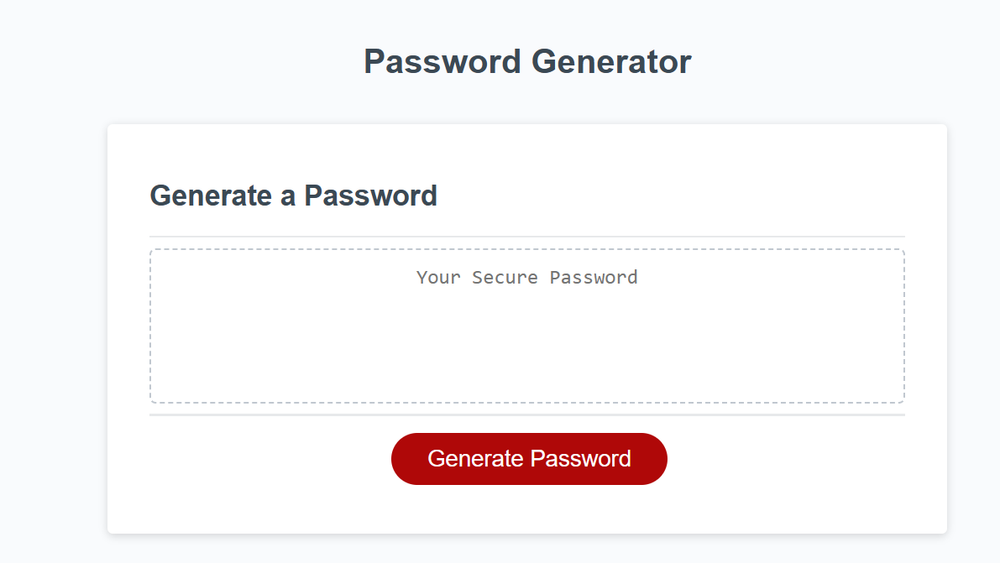

# Password-Generator

A simple web-based password generator that allows users to generate secure passwords based on their criteria. This project includes HTML, CSS, and JavaScript to create an interactive user experience.

## Features

- Generate passwords with various criteria:
  - Password length between 8 and 128 characters.
  - Inclusion of lowercase and uppercase characters.
  - Inclusion of numeric characters.
  - Inclusion of special characters.
- Input validation to ensure valid password criteria.
- User-friendly interface.

## Usage

1. Open the password generator in a web browser.
2. Click the "Generate Password" button to start the password generation process.
3. Follow the prompts to select the desired criteria for your password:
   - Enter the password length.
   - Choose whether to include lowercase, uppercase, numeric, and special characters.
4. The generated password will be displayed in the textarea.

## Website :

To access the password generator: 

